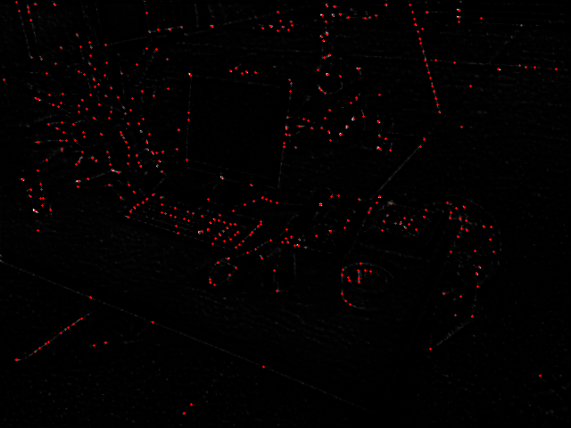
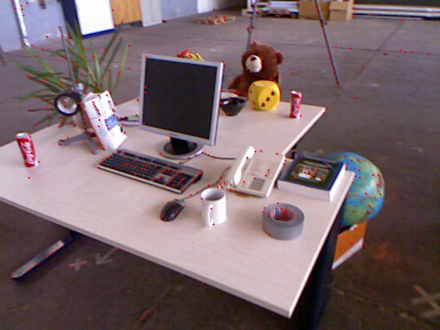

# ALIKE feature extractor and keypoints detector integrated inside OpenVINS as visual odometry frontend

## System requirements
1. `x86` CPU
2. `CUDA`-enabled GPU

## Prerequisites
1. Docker desktop or engine
2. [Nvidia container toolkit](https://docs.nvidia.com/datacenter/cloud-native/container-toolkit/latest/install-guide.html)

## Installation 
1. Clone the project and open it in any IDE with devcontainers support
```bash
mkdir openvins && cd openvins
git clone https://github.com/Raspy-Py/OpenVINS-DL-VIO.git .
```

2. Reopen the project in devcontainer. Preferably, in VSCode
3. Ensure you are in the workspace directory, inside the container
```bash
cd /opt/baza
```

4. Build the project (it takes a while)
```bash
# For the first time build you may wanna limit the amout of jobs, if you have less then 20GB of RAM
catkin config --jobs 4 
```

```bash
catkin init
catkin build
source ~/.bashrc # to make all built modules visible 
catkin install
```

5. Run ALIKE test target to ensure the enviroment is healthy.
```bash
/opt/bash/install/alike_extractor/alike_test \
    /opt/baza/src/alike_extractor/models/normal_640x480.onnx \
    /opt/baza/images/test_examples/tum_input.png \
    /opt/baza/images/test_ouputs
```
Check inside `/opt/baza/images/test_examples` for such expected results
|  |  |  |
|:----------------------:|:----------------------:|:----------------------:|
| scores map | labeled scores map | results image |
